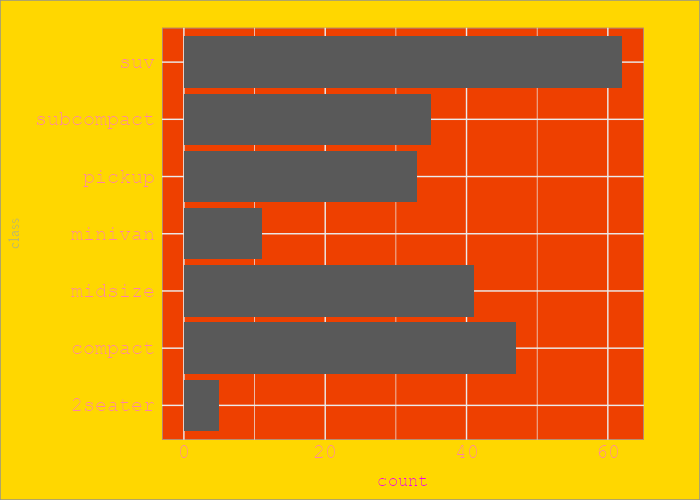
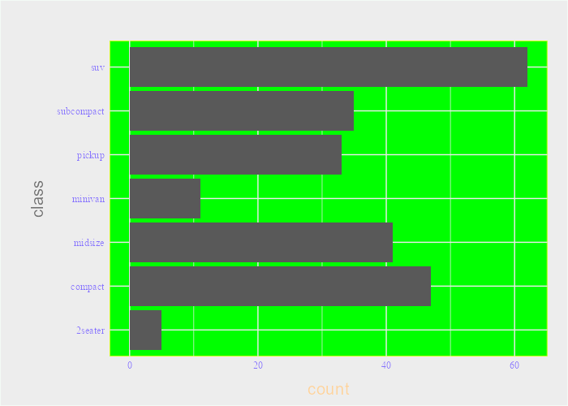
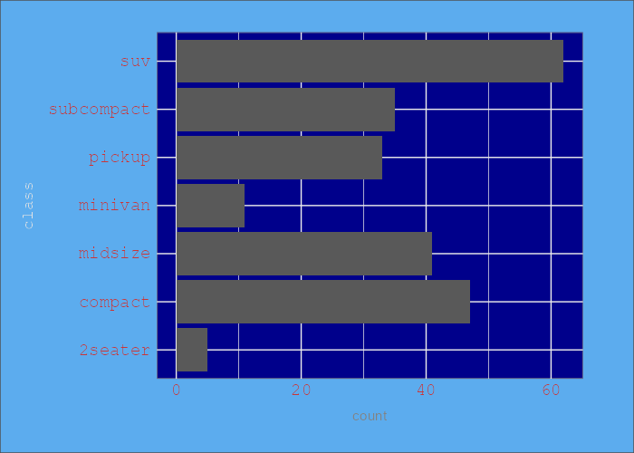
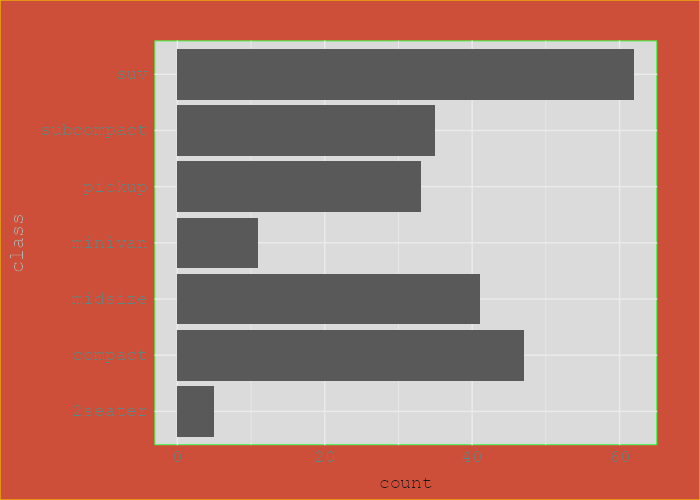

# useless

An R package with some additional useless functions.

## Installation

``` r
remotes::install_github("nrennie/useless")
```

## Examples

```r
library(ggplot2)
ggplot(mpg) +
  geom_bar(aes(y = class)) +
  theme_chaos()
```

<p align="center">


</p>

<p align="center">


</p>

